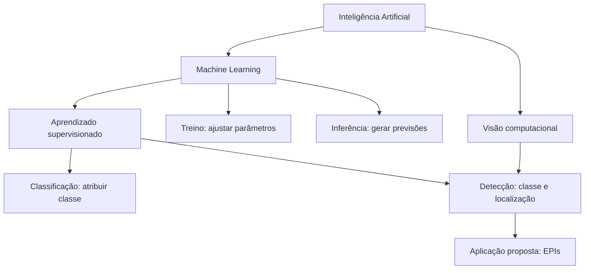

# Mapa conceitual inicial — revisar após estudo

```mermaid
flowchart TD
  IA["Inteligência Artificial"] --> ML["Machine Learning"]
  IA --> VC["Visão computacional"]
  ML --> SUP["Aprendizado supervisionado"]
  SUP --> CL["Classificação: atribuir classe"]
  SUP --> DET["Detecção: classe e localização"]
  VC --> DET
  DET --> EPI["Aplicação proposta: EPIs"]
  ML --> TR["Treino: ajustar parâmetros"]
  ML --> INF["Inferência: gerar previsões"]
```

Exemplo preparado com auxílio de IA. Estudar os conceitos e adaptar com fontes e compreensão própria.
